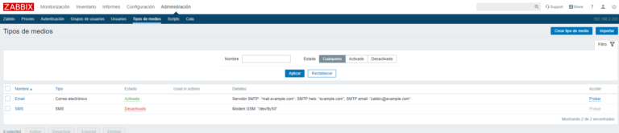
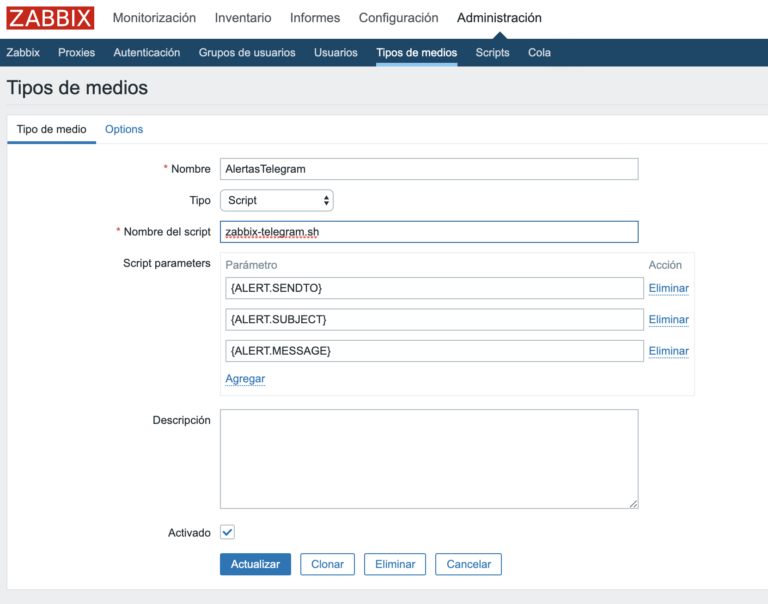
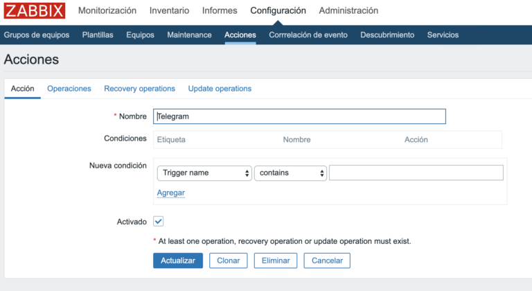
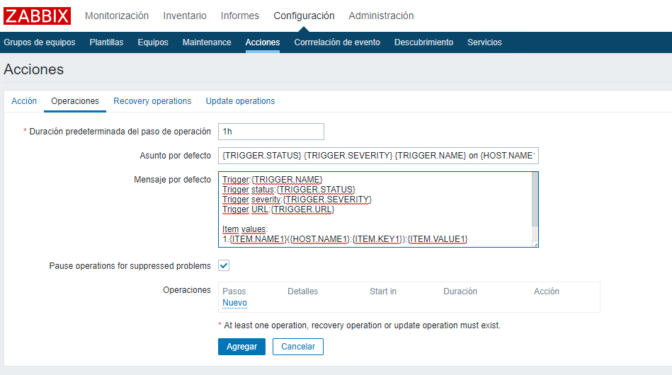

# Bot de Telegram para Servidores Zabbix

Documentación sobre como implementar un bot de Telegram en un servidor Zabbix.

---

## Requisitos

* Servidor Zabbix 3.0 o superior
* Canal de Telegram
* Bot de Telegram

## ¿Para qué sirve un servidor Zabbix?

Zabbix es una herramienta de monitoreo de red y aplicaciones, que permite monitorear la disponibilidad y el rendimiento de sus servidores, aplicaciones y redes. Zabbix es una herramienta de código abierto, lo que significa que es gratuita y que puede ser modificada para adaptarse a sus necesidades.

## ¿Para qué sirve un bot de Telegram?

Un bot de Telegram es un programa que se ejecuta dentro de Telegram. Puede realizar tareas como buscar información en Internet, descargar archivos, enviar mensajes, etc. Los bots de Telegram son una forma divertida de interactuar con sus amigos o simplemente pasar el rato.

## ¿Para qué sirve un canal de Telegram?

Un canal de Telegram es un tipo de chat que puede tener un número ilimitado de miembros. Los canales son una forma de comunicarse con sus clientes o suscriptores. Puede enviar mensajes, archivos, fotos, videos, etc. a todos sus miembros de una sola vez.

## ¿Cómo funciona?

El bot de Telegram se comunica con el servidor Zabbix a través de la API de Zabbix. El bot de Telegram se comunica con el canal de Telegram a través de la API de Telegram. Se reciben alertas de los servidores Zabbix y se envían a los canales de Telegram.

---

## Guía paso a paso

### 1. Crear un bot de Telegram

Para crear un bot de Telegram, debe iniciar sesión en Telegram y buscar el bot @BotFather. Luego, envíe el comando /newbot y siga las instrucciones.

```console

demontaim@heaven:~$ /newbot

```

Después de crear el bot, otorgarle una descripción y nombre, el BotFather le dará un token de acceso. Guarde este token de acceso, ya que lo necesitará más adelante.

### 2. Crear un canal de Telegram

Creamos un canal de Telegram e invitamos al bot de Telegram como si de un usuario normal se tratara.

A su vez también añadimos al bot RawDataBot, que nos permitirá obtener el ID del canal.

Una vez que tenemos a los dos bots en el grupo escribimos /getgroupid y automáticamente nos devolverá el ID de la sección Chat que usaremos con el Token para configurar Zabbix.

```console

demontaim@heaven:~$ /getgroupid

```

### 3. Instalar el bot de Telegram en el servidor Zabbix

Para instalar el bot de Telegram en el servidor Zabbix, debemos introducir un Script en la siguiente ruta, yo sugiero conectarnos por SSH y crear el archivo con el editor de texto nano.

```console

demontaim@heaven:~$ nano /usr/lib/zabbix/alertscripts/telegram.sh

```

Una vez creado el archivo, copiamos el siguiente código y lo pegamos en el archivo que acabamos de crear.

```bash

#!/bin/bash

######################################################
# Zabbix-Telegram envio de alerta por Telegram
# Date: 01/05/2020
# Script Raul Unzue - https://www.maquinasvirtuales.eu
######################################################

MAIN_DIRECTORY="/usr/local/share/zabbix/alertscripts"
# To enable the debug set here path of file, otherwise set /dev/null
DEBUG_FILE="/dev/null"

#############################################
# Argument to pass to the script and its manipulation
#############################################

USER=$1
SUBJECT=$2
DEBUG_SUBJECT=$2
TEXT=$3
DEBUG_TEXT=$3

# Check if there is only 2 argument (no test message, only subject)

if [ -z "$TEXT" ]
then
	TEXT=""
	DEBUG_TEXT=""
fi

# Get status and severity from subject

STATUS=$(echo $SUBJECT | awk '{print $1;}')
SEVERITY=$(echo $SUBJECT | awk '{print $2;}')
#STATUS=$(echo $SUBJECT | grep -o -E "(U[0-9A-F]{4}|U[0-9A-F]{3})")
SUBJECT=${SUBJECT#"$STATUS "}
SUBJECT=${SUBJECT#"$SEVERITY "}
SUBJECT="${SUBJECT//,/ }"

# Get graphid from text

GRAPHID=$(echo $TEXT | grep -o -E "(Item Graphic: \[[0-9]{7}\])|(Item Graphic: \[[0-9]{6}\])|(Item Graphic: \[[0-9]{5}\])|(Item Graphic: \[[0-9]{4}\])|(Item Graphic: \[[0-9]{3}\])")
TEXT=${TEXT%"$GRAPHID"}
MESSAGE="chat_id=${USER}&text=${TEXT}"
GRAPHID=$(echo $GRAPHID | grep -o -E "([0-9]{7})|([0-9]{6})|([0-9]{5})|([0-9]{4})|([0-9]{3})")

# Save text to send in file

ZABBIXMSG="/tmp/telegram-zabbix-message-$(date "+%Y.%m.%d-%H.%M.%S").tmp"
echo "$MESSAGE" > $ZABBIXMSG

#############################################
# Zabbix address
#############################################
ZBX_URL="https://servidorzabbix"

##############################################
# Zabbix credentials to login
##############################################

USERNAME="usuario"
PASSWORD="passwd"

#############################################
# Zabbix versione >= 3.4.1
# 0 for no e 1 for yes
#############################################

ZABBIXVERSION44="0"

############################################
# Bot data from Telegram
############################################

BOT_TOKEN='TokenIDdelBotfather'

# If the GRAPHID variable is not compliant not send the graph

case $GRAPHID in
	''|*[!0-9]*) SEND_GRAPH=0 ;;
	*) SEND_GRAPH=1 ;;
esac

#############################################
# To disable graph sending set SEND_GRAPH = 0, otherwise SEND_GRAPH = 1
# To disable message content sending set SEND_MESSAGE = 0, otherwise SEND_MESSAGE = 1
#############################################

SEND_GRAPH=1
SEND_MESSAGE=1

# If the GRAPHID variable is not compliant, not send the graph

case $GRAPHID in
    ''|*[!0-9]*) SEND_GRAPH=0 ;;
esac


##############################################
# Graph setting
##############################################

WIDTH=800
CURL="/usr/bin/curl"
COOKIE="/tmp/telegram_cookie-$(date "+%Y.%m.%d-%H.%M.%S")"
PNG_PATH="/tmp/telegram_graph-$(date "+%Y.%m.%d-%H.%M.%S").png"

############################################
# Width of graphs in time (second) Ex: 10800sec/3600sec=3h 
############################################

PERIOD=10800

###########################################
# Check if at least 2 parameters are passed to script
###########################################

if [ "$#" -lt 2 ]
then
	exit 1
fi

###########################################
# Convert STATUS and SEVERITY from text to ICON
# used https://apps.timwhitlock.info/emoji/tables/unicode to get icon 
# and https://codepoints.net/U+26A0 to get URL-quoted code
###########################################

case $STATUS in
	"PROBLEM") ICON="%E2%9A%A0";; #Warning sign
	"OK") ICON="%E2%9C%85";; #Check mark
	*) ICON="";;
esac

case $SEVERITY in
	"Not classified") ICON_SEV="%E2%9C%89";; # Envelope
	"Information") ICON_SEV="%F0%9F%98%8C";; # Relieved face
	"Warning") ICON_SEV="%F0%9F%98%9E";; # Disappointed face
	"Average") ICON_SEV="%F0%9F%98%A8";; # Fearful face
	"High") ICON_SEV="%F0%9F%98%A9";; # Weary face
	"Disaster") ICON_SEV="%F0%9F%98%B1";; # Face screeaming in fear
	*) ICON_SEV="";;
esac

############################################
# Send messages with SUBJECT and TEXT
############################################

${CURL} -k -s -S --max-time 5 -c ${COOKIE} -b ${COOKIE} -X GET "https://api.telegram.org/bot${BOT_TOKEN}/sendMessage?chat_id=${USER}&text=${ICON} ${ICON_SEV} ${SUBJECT}" > $DEBUG_FILE

if [ "$SEND_MESSAGE" -eq 1 ]
then
	${CURL} -k -s -S --max-time 5 -c ${COOKIE} -b ${COOKIE} --data-binary @${ZABBIXMSG} -X GET "https://api.telegram.org/bot${BOT_TOKEN}/sendMessage" >> $DEBUG_FILE
fi

############################################
# Send graph
############################################

# If SEND_GRAPH=1 send the graph
if [ $(($SEND_GRAPH)) -eq '1' ]; then
	
	# First, login to Zabbix GUI
	# (check if there is "Sign in" in the button to login, otherwise change the web parameters here 

	${CURL} -k -s -S --max-time 5 -c ${COOKIE} -b ${COOKIE} -d "name=${USERNAME}&password=${PASSWORD}&autologin=1&enter=Sign%20in" ${ZBX_URL}"/index.php" >> $DEBUG_FILE

	# In some case is useful send personalized graph instead of graph of last data of item
	# So, put in TEXT variable a personalized GRAPHID, that here is managed differently from classic item GRAPHID
	if [ "${GRAPHID}" == "000001" ]; then
		GRAPHID="00002";
		${CURL} -k -s -S --max-time 5 -c ${COOKIE} -b ${COOKIE} -d "graphid=${GRAPHID}&period=${PERIOD}&width=${WIDTH}" ${ZBX_URL}"/chart2.php" -o "${PNG_PATH}";
	elif [ "${GRAPHID}" == "000002" ]; then
		GRAPHID="00003";
		${CURL} -k -s -S --max-time 5 -c ${COOKIE}  -b ${COOKIE} -d "graphid=${GRAPHID}&period=${PERIOD}&width=${WIDTH}" ${ZBX_URL}"/chart2.php" -o "${PNG_PATH}";
	elif [ "${GRAPHID}" == "000003" ]; then
		GRAPHID="00004";
		${CURL} -k -s -S --max-time 5 -c ${COOKIE}  -b ${COOKIE} -d "graphid=${GRAPHID}&period=${PERIOD}&width=${WIDTH}" ${ZBX_URL}"/chart2.php" -o "${PNG_PATH}";
	else
		# If no personalized GRAPHID passed, download the image of graph of item
		if [ "${ZABBIXVERSION34}" == "1" ]; then
			${CURL} -k -s -S --max-time 5 -c ${COOKIE}  -b ${COOKIE} -d "itemids=${GRAPHID}&period=${PERIOD}&width=${WIDTH}&profileIdx=web.item.graph" ${ZBX_URL}"/chart.php" -o "${PNG_PATH}";
		else
			${CURL} -k -s -S --max-time 5 -c ${COOKIE}  -b ${COOKIE} -d "itemids=${GRAPHID}&period=${PERIOD}&width=${WIDTH}" ${ZBX_URL}"/chart.php" -o "${PNG_PATH}";
		fi
	fi
	
	# Send the image to Telegram
	${CURL} -k -s -S --max-time 5 -X POST "https://api.telegram.org/bot${BOT_TOKEN}/sendPhoto" -F chat_id="${USER}" -F photo="@${PNG_PATH}"  >> $DEBUG_FILE

fi

############################################
# DEBUG
############################################

# To verify invoked argument use this command ###########
# cat /tmp/telegram-debug.txt
# To enable the debug uncomment this line
# echo "User-Telegram=$USER | Debug subject=$DEBUG_SUBJECT | Subject=$ICON $SUBJECT | Debug Text=$DEBUG_TEXT | Message=$MESSAGE | GraphID=${GRAPHID} | Period=${PERIOD} | Width=${WIDTH}" >> $DEBUG_FILE

# To verify message sending ###########

# Sending message
# If messagge is correctly send the response of curl is similar to  {"ok":true,"result":{"message_id":xxx,"from":{"id":xxxx,"first_name":"xxx","username":"xxxx"},"chat":{"id":xxxxx,"first_name":"xxx","last_name":"xxx","username":"xxxxx","type":"private"},"date":xxxx,"text":"teste"}}
# If the response is different check the BOT_TOKEN
# ${CURL} -k -c ${COOKIE} -b ${COOKIE} -X GET "https://api.telegram.org/bot${BOT_TOKEN}/sendMessage?chat_id=${USER}&text=${SUBJECT}"

# API to send the image
# ${CURL} -k -X POST "https://api.telegram.org/bot${BOT_TOKEN}/sendPhoto" -F chat_id="${USER}" -F photo="@${PNG_PATH}"

# To verify login process ###########
# Launch this command and check: if return nothing all is ok, otherwise there is something wrong
# after each execution delete the file /tmp/cookie
# curl -k -s -c /tmp/cookie -b /tmp/cookie -d "name=${USERNAME}&password=${PASSWORD}&autologin=1&enter=Sign%20in" http://192.168.10.24/index.php 


############################################
# Clean file used in the script execution
############################################

rm -f ${COOKIE}

rm -f ${PNG_PATH}

# Comment this line if preserve all sended message for archival purpose
rm -f ${ZABBIXMSG}

exit 0

```

Le damos permisos de ejecución al script:

```console

demontaim@heaven:~$ sudo chmod +x /etc/zabbix/scripts/telegram.sh

```

---

### Modificamos los parámetros de la acción

**ZBX_URL**: URL de Zabbix.

**USERNAME**: User de Zabbix.

**PASSWORD**: Password de Zabbix.

**ZABBIXVERSION44**: Si la versión de Zabbix es 3.4 o superior poner 1, si es inferior poner 0.

**BOT_TOKEN**: Token del bot de Telegram.

---

### Creamos un medio de comunicación

Vamos a la sección de **Administración** --> **Tipos de medios** y creamos uno nuevo:



Configuramos un medio tipo script que ejecute el script que hemos creado:



Para que nuestro script funcione debemos indicarle una acción:



En la pestaña **Operaciones** indicamos los parámetros por defecto que tendrá el mensaje:



**Asunto por defecto**: {TRIGGER.STATUS} {TRIGGER.SEVERITY} {TRIGGER.NAME} on {HOST.NAME1}

**Mensaje por defecto**: Trigger:{TRIGGER.NAME}
Trigger status:{TRIGGER.STATUS}
Trigger severity:{TRIGGER.SEVERITY}
Trigger URL:{TRIGGER.URL}
 
Item values:
1.{ITEM.NAME1}({HOST.NAME1}:{ITEM.KEY1}):{ITEM.VALUE1}

Item Graphic:[{ITEM.ID1}]
